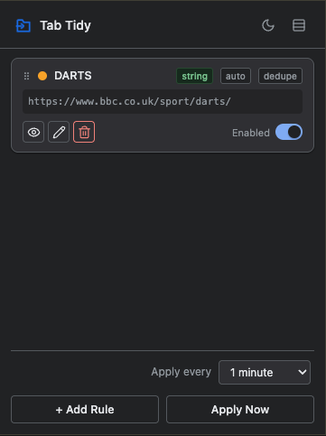
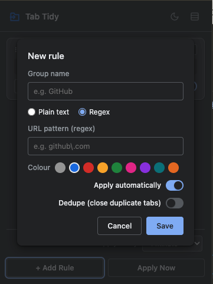
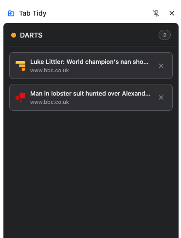

# Tab Tidy

A Chrome extension that automatically groups open tabs into named, coloured tab groups based on URL match rules you define. It never closes tabs — only organises them.

<p>
  
  
  
</p>

## Features

- **Rules** — define a name, a match pattern (plain text or regex), and a colour. Matching tabs get grouped per-window into a tab group named after the rule.
- **Auto-apply** — rules reapply automatically on a configurable interval (1 min – 1 hour) and on browser startup, so newly opened tabs get grouped without you doing anything. Each rule can also be set to manual-only.
- **Dedupe** — optionally close duplicate tabs (exact URL match) as they're grouped.
- **Drag to reorder** — rule order determines match precedence when a tab matches more than one rule.
- **Group adoption** — if a rule's tracked group is gone but an unmanaged tab group with the same name exists, the rule adopts it instead of creating a duplicate.
- **Side panel** — click "View" on a rule to open a live card view of every tab currently in its group, with quick activate/close actions.
- **Compact view** — collapse the rules list to one row per rule.
- **Light/dark theme** — follows your OS by default; toggle manually from the popup header.

## Installing (unpacked)

1. Clone this repo.
2. Open `chrome://extensions` in Chrome.
3. Enable **Developer mode** (top right).
4. Click **Load unpacked** and select the repo folder.

## Usage

1. Click the Tab Tidy icon in the toolbar.
2. Click **+ Add Rule**, give it a name, a match pattern, and a colour.
   - **Plain text** matches if the pattern appears anywhere in the URL.
   - **Regex** matches the URL against the pattern (case-insensitive).
3. Matching tabs get grouped automatically. Use **Apply Now** to run rules immediately, or click a rule's **View** button to inspect its tabs in the side panel.

## Project structure

```
background/
  service-worker.js     entry point
  event-listeners.js    alarm/startup/install listeners, message handling
  group-manager.js      rule matching engine, tab group creation/reconciliation

popup/
  popup.html / popup.js shell
  rules-panel.js        rules list, add/edit/delete/reorder UI

sidepanel/
  sidepanel.html/js/css live card view of a rule's tabs

shared/
  constants.js           alarm config, storage keys, tab group colours
  storage.js              chrome.storage helpers
  theme.js                light/dark theme handling
```

## Data persisted

- `groupRules` — `Array<{ id, name, pattern, matchType, color, enabled, autoApply, dedupe }>`
- `autoGroups` — `{ [windowId]: { [ruleId]: groupId } }`, so reapplying rules reuses existing groups instead of creating duplicates
- `applyIntervalMinutes`, `compactRulesView`, `theme` — UI preferences
- `viewingRule` (session-only) — which rule the side panel is currently showing
